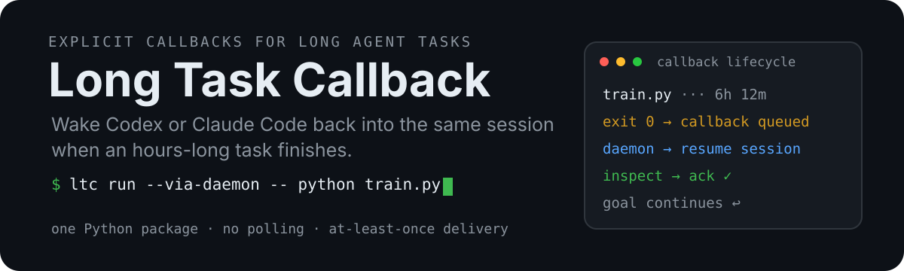
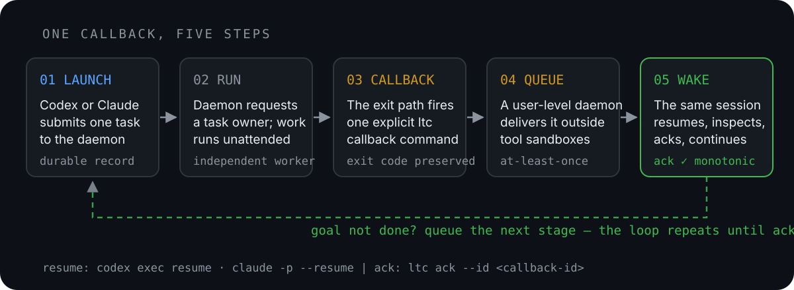

<p align="center">
  
</p>

<p align="center">
  <a href="https://github.com/lz59970062/long-task-wakeup"></a>
  <a href="./pyproject.toml"></a>
  
</p>

**Long Task Callback (ltc)** gives long-running agent work a durable process owner and an explicit
way back to the same conversation.

There are only two normal entry points:

- **Run** — `ltc run -- <command>` submits a new task. The daemon starts it in GNU
  screen, so it is not owned by the agent turn.
- **Done** — `ltc done ...` reports completion of a task that is already owned by
  screen, tmux, Slurm, another scheduler, or an existing script.

The daemon is the control and callback-delivery process. It does not become the parent of the
training process. GNU screen owns the LTC worker and the worker owns the task.

[中文说明](#中文说明) · Formerly `codex-long-task-wakeup` (the old command remains an alias)

## How it works

<p align="center">
  
</p>

```text
systemd user service
  └─ ltc daemon                 control, recovery and callback delivery

GNU screen session
  └─ LTC worker
      └─ training / benchmark / build
```

1. Codex or Claude Code submits `ltc run`. LTC persists the command, environment,
   original agent/session binding, goal binding, screen name, and log path.
2. The systemd-managed daemon notices the submission and starts a detached GNU screen session.
3. The screen-owned task runs independently of the agent turn and of daemon restarts.
4. On completion, LTC stores the exit result and queues a callback to the original conversation.
5. The resumed agent inspects the result and runs `ltc ack`. If the callback belongs to a
   multi-stage goal, callback ACK and goal ACK remain separate decisions.

No polling is required. Live inspection is available through screen and the task log.

As an execution rule, a command reliably expected to finish within 60 seconds may use one
foreground wait. Use `ltc run` when it may take about a minute or longer, its duration is
uncertain, or another status check might be needed. A few-minute task should use callback delivery
instead of model polling; screen and the daemon wait without spending model turns.

## Install

GNU screen is required. LTC deliberately has no silent fallback because a fallback would restore
the unstable agent-owned process path.

```bash
sudo apt install screen              # Debian/Ubuntu
# sudo dnf install screen            # Fedora/RHEL

python3 -m pip install "git+https://github.com/lz59970062/long-task-wakeup.git"
ltc setup --force --enable --now
```

`setup` installs the bundled skill for Codex and Claude Code and installs the callback daemon as a
user service. It refuses to continue when GNU screen is unavailable.

Verify:

```bash
ltc --version
screen --version
systemctl --user status codex-long-task-wakeup.service
```

## Run: submit a new long task

```bash
ltc run \
  --cwd "$PWD" \
  --task "train model" \
  -- python train.py --config configs/exp.yaml
```

Submission returns after the task record is durable. It prints:

- the task id;
- the screen session, `ltc-<task-id>`;
- the log file, normally
  `~/.codex/long-task-wakeup/tasks/<task-id>/attempt-1.log`.

Inspect it when useful:

```bash
screen -ls
screen -r ltc-<task-id>
tail -f ~/.codex/long-task-wakeup/tasks/<task-id>/attempt-1.log
```

Detach from screen with `Ctrl-a d`; detaching does not stop the task.

## Done: report an externally managed task

Use `done` when LTC should not launch or own the task:

```bash
set +e
python train.py --config configs/exp.yaml
status=$?
ltc done \
  --cwd "$PWD" \
  --task "train model" \
  --command "python train.py --config configs/exp.yaml" \
  --exit-code "$status"
exit "$status"
```

This pattern belongs inside a screen/tmux session, Slurm epilogue, scheduler job, shell trap, or
Python `finally`. `done` only queues the callback; it does not make the preceding process durable.
By default callback failure does not change the task exit code.

## Restart and recovery behavior

### Daemon restart

GNU screen keeps running. After the daemon returns, it discovers the live named session and does
not launch a duplicate. If the task completed while the daemon was unavailable, its durable result
is turned into the normal callback.

### Same-host reboot

GNU screen cannot survive a host reboot. LTC therefore does **not** guess or automatically rerun
the command. After the daemon starts in the new boot, it restores the originally bound Codex or
Claude Code conversation with:

- the task and screen identifiers;
- the local log path;
- the interruption reason;
- instructions to inspect outputs and checkpoints.

That agent then follows the normal task-creation workflow: recreate the run from a valid checkpoint,
supplement the status if artifacts prove it already finished, or record the precise blocking
condition. There is no `--resume-command` interface.

### Cross-host recovery

Cross-host recovery is intentionally unsupported. LTC does not transfer workspaces, datasets,
environments, checkpoints, credentials, or compute allocation to another machine.

## Two acknowledgement layers

Callback delivery ACK confirms that one wakeup was received and inspected:

```bash
ltc ack --queue-dir <queue-dir> --id <callback-id>
```

An unacknowledged callback is retried with backoff. ACK is monotonic.
An ACK marker immediately ends Desktop completion-stream waiting and releases the delivery lease,
even if the App Server completion notification is unavailable.
The resumed agent writes only the queue ACK marker. Global target-lock cleanup is performed by the
daemon, so ACK does not require broader filesystem permissions.

Goal ACK answers a different question: whether the whole multi-stage objective is finished or
cannot proceed:

```yaml
# goal-plan.yaml
version: 1
revision: 1
goal: Finish and publish the report
path:
  - id: draft
    title: Complete the draft
    status: completed
  - id: verify
    title: Verify figures and references
    status: in_progress
  - id: publish
    title: Publish the final report
    status: pending
amendments:
  - revision: 1
    reason: Initial path
```

```bash
ltc goal start --id report-goal --session <session-id> --cwd "$PWD" \
  --task "finish the report" --plan-file goal-plan.yaml
ltc goal check --id report-goal
ltc goal ack --id report-goal --state completed --plan-sha256 <checked-sha256>
ltc goal ack --id report-goal --state blocked_conditions --condition "awaiting dataset access"
ltc goal resume --id report-goal
```

The YAML file is the mutable source of truth. Its ordered `path` uses `pending`, `in_progress`,
`blocked`, and `completed`; completed items must be a continuous prefix. It tells the resumed
agent exactly which item is current and what remains. Users may revise later items, reopen work,
append steps, or change the top-level goal, preferably incrementing `revision` and recording the
reason in `amendments`.

Before reporting completion, the agent must run `goal check` and compare actual work and artifacts
with the latest file. `goal ack --state completed` is rejected unless the supplied digest matches
that check and every path item, including the final one, is `completed`. Any YAML edit invalidates
the previous digest and forces a fresh check, so a remembered obsolete plan cannot finish a goal.
Existing active goals created before 0.6.2 can be migrated with
`ltc goal set-plan --id <goal-id> --plan-file goal-plan.yaml`; attaching or replacing a plan also
clears the previous check.

Use one file per independent goal, preferably `.ltc/goals/<goal-id>.yaml`. A clear, low-risk path
may be drafted by the agent and announced without a blocking approval; strategic choices,
material resource changes, or changed acceptance criteria should be agreed with the user first.
Blocked, resumed, and revised work keeps the same file. A follow-on goal gets a new file. Completed
plans remain at their recorded paths as audit records and are never automatically deleted or
reused. If archival relocation is desired, move and reattach the file with `goal set-plan` before
the final check and completion ACK.

Callback ACK never completes the goal. While an active goal has no newly queued ordinary callback,
the daemon automatically asks the same conversation for its status every three hours by default.
The agent must continue, ACK the goal as completed, or record the exact blocked condition. This
inquiry behavior also applies after reboot recovery.

Bind a submitted task or an external completion callback with `--goal-id <goal-id>`.

## Session binding

Inside an agent conversation, LTC normally binds automatically:

- Codex: `CODEX_THREAD_ID`
- Claude Code: `CLAUDE_CODE_SESSION_ID`

Explicit binding is also supported:

```bash
ltc done --agent claude --session <session-id> \
  --cwd "$PWD" --task "external job" --exit-code 0
```

`--last` is an unsafe fallback and always warns. If no target can be determined, LTC fails rather
than guessing.

## Operations and guarantees

```bash
ltc status
ltc cancel --id <callback-id>
ltc install-shell-hook
```

State lives under `${CODEX_HOME:-~/.codex}/long-task-wakeup/`. The queue uses stable callback ids,
durable ACK markers, and per-session locks. Delivery is at-least-once, not exactly-once: after a
host failure, an already received but not durably ACKed callback may be delivered again. Resumed
agents must inspect existing processes and artifacts before launching follow-up work.

The daemon is normally installed as
`~/.config/systemd/user/codex-long-task-wakeup.service`. The daemon may also be run by supervisor
or as a standalone background process in environments without user systemd; GNU screen remains
mandatory for `Run` task ownership in every case.

```bash
systemctl --user status codex-long-task-wakeup.service
journalctl --user -u codex-long-task-wakeup.service -f
```

Old scripts may still pass `--via-daemon`. It is accepted as a hidden no-op compatibility flag;
both `run` and `done` already use the daemon by default. There is no direct agent-owned execution
mode and no fallback to one.

## 中文说明

**Long Task Callback (ltc)** 只有两个需要记住的入口：

- **Run**：`ltc run -- <命令>`。提交一个新任务；daemon 收到记录后，用 GNU
  screen 启动 LTC worker 和训练任务。
- **Done**：`ltc done ...`。任务已经由 screen、tmux、Slurm 或其他调度器托管时，
  只报告结束并投递 callback。

正确的职责关系是：

```text
systemd 用户服务
  └─ ltc daemon                 负责控制、恢复和 callback 投递

GNU screen 会话
  └─ LTC worker
      └─ 训练任务
```

daemon 不是训练任务的父进程。它重启时，screen 中的任务继续运行；daemon 回来后识别已有
screen，不会重复启动。screen 是必需依赖，缺失时 `setup` 和 `run` 都会拒绝，
不会退回到不稳定的 agent 回合进程。

使用原则：只有可靠地在 60 秒内结束的命令才允许前台等待一次。预计约一分钟以上、耗时不确定，
或可能需要第二次状态检查时，从一开始就使用 `ltc run`。几分钟任务也默认走 callback，
不要为了维持模型缓存而轮询；screen 和 daemon 的等待不产生模型回合。

```bash
ltc run --cwd "$PWD" --task "train model" \
  -- python train.py --config configs/exp.yaml
```

命令会打印 task id、`ltc-<task-id>` screen 名和日志路径。用户可以随时检查：

```bash
screen -ls
screen -r ltc-<task-id>
tail -f ~/.codex/long-task-wakeup/tasks/<task-id>/attempt-1.log
```

主机重启后 screen 不会保留。LTC 不自动重跑，而是恢复最初绑定的 Codex 或 Claude Code
会话，把任务、日志、checkpoint 相关上下文和中断原因交回该 agent。agent 自己检查本地产物，
再按标准流程从有效 checkpoint 重建任务、补充完成状态，或记录明确阻塞。没有
`--resume-command`。跨主机恢复不支持，因为它需要额外传输工程、数据、环境、checkpoint 和资源。

两层 ACK 都保留：

1. `ltc ack` 表示本次 callback 已收到并检查；
2. `ltc goal ack --state completed|blocked_conditions` 表示整个阶段目标完成或满足阻塞条件。

从 0.6.2 开始，goal 必须绑定一个可修改的 YAML 目标计划文件：

```yaml
version: 1
revision: 1
goal: 完成并发布 0.6.2
path:
  - id: implement
    title: 实现功能
    status: completed
  - id: verify
    title: 验证功能和回归测试
    status: in_progress
  - id: publish
    title: 发布版本
    status: pending
amendments:
  - revision: 1
    reason: 初始执行路径
```

`path` 是有顺序的小目标路径，状态可为 `pending`、`in_progress`、`blocked` 或
`completed`；已完成项必须构成连续前缀。用户可以修改后续小目标、重新打开前面的步骤、增加或
删除步骤，也可以修改顶层大目标。建议同时递增 `revision`，并在 `amendments` 记录修改原因。
后续提醒与检查始终读取文件的最新版本，而不是沿用 AI 记忆中的旧目标。

```bash
ltc goal start --id release-goal --session <session-id> --cwd "$PWD" \
  --task "发布 0.6.2" --plan-file goal-plan.yaml
ltc goal check --id release-goal
ltc goal ack --id release-goal --state completed --plan-sha256 <本次检查输出的摘要>
```

AI 在回复“目标已完成”之前必须执行 `goal check`，并把实际工作和产物逐项对照最新 YAML。
只有最后一个项目以及之前所有项目均确认 `completed`，且完成命令携带本次检查的文件摘要时，
CLI 才接受 goal 完成。文件一旦修改，旧摘要立即失效，必须重新检查新路径。
0.6.1 已存在的活跃 goal 可用
`ltc goal set-plan --id <goal-id> --plan-file goal-plan.yaml` 绑定或更换计划文件；绑定后旧检查
记录会被清除。

每个独立 goal 使用一个独立文件，推荐路径为 `.ltc/goals/<goal-id>.yaml`。目标和路线清晰、
风险低时，AI 可以直接起草文件，告知用户文件位置和主要步骤后继续，不必额外停下来等待确认；
如果涉及路线选择、明显的资源变化、验收标准变化或其他重要取舍，应先和用户协商。阻塞、恢复和
修订继续使用同一文件，终态完成后衍生出的任务则创建新 goal 和新文件。完成文件默认留在原路径
作为审计记录，不自动删除或复用；如需移入归档目录，应在 goal 仍活跃时移动文件，使用
`goal set-plan` 更新路径，再执行最后一次检查和完成 ACK。

callback ACK 不会顺带完成 goal。活跃 goal 默认三小时没有新 callback 时，daemon 会自动恢复
原会话问询阶段状态；重启恢复后也遵守同一规则。
普通 ACK 只写 callback queue；全局 target-lock 的清理由 daemon 完成，不需要给恢复后的
agent 扩大文件系统写权限。
ACK marker 一旦存在，completion stream 的等待必须立即结束并释放 delivery lease，
不能继续等待 Desktop App Server 的 `turn/completed` 通知。

旧脚本中的 `--via-daemon` 仍可作为隐藏的无效果兼容参数使用，但新命令不应再写它。`run`
和 `done` 已经固定走 daemon，不存在直接由 agent 回合执行或投递的模式。

## License

MIT
