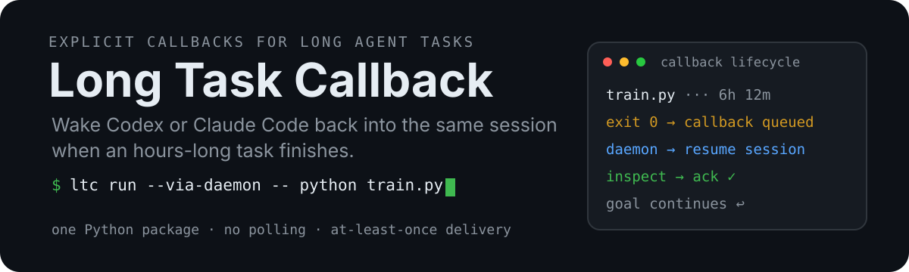
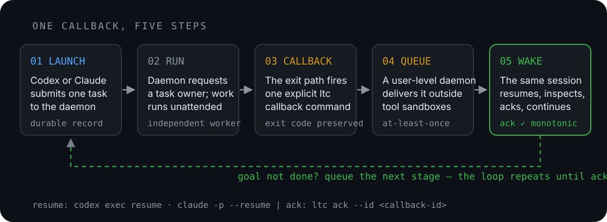

<p align="center">
  
</p>

<h3 align="center">Stop babysitting long-running jobs. Let your agent sleep — and wake it up when the work is done.</h3>

<p align="center">
  <a href="https://github.com/lz59970062/long-task-wakeup/tree/v0.7.0"></a>
  <a href="./CHANGELOG.md"></a>
  
  
  
  <a href="./LICENSE"></a>
</p>

<p align="center">
  <a href="#-quick-start">Quick start</a> ·
  <a href="#-how-it-works">How it works</a> ·
  <a href="#-usage">Usage</a> ·
  <a href="#-documentation">Docs</a> ·
  <a href="./README.zh-CN.md">中文</a>
</p>

---

## The problem

You ask Codex or Claude Code to train a model, run a benchmark, or build a big project. The job takes
two hours. Now what?

- The agent **polls** with `sleep && tail` — burning turns, tokens and context on nothing.
- Or the job is **owned by the agent's shell**, so it dies when the turn ends, times out, or the app restarts.
- Or you **come back later** and have to re-explain everything to a fresh conversation.

## The fix

**Long Task Callback (`ltc`)** hands the job to an independent, OS-native process owner and, when it
finishes, **resumes the exact same conversation** with a compact result — exit code, log path,
artifacts, and the command to acknowledge it.

```console
$ ltc run --task "train model" -- python train.py --config configs/exp.yaml
ltc: submitted managed task <task-id>
ltc: execution backend: systemd
...
```

The agent ends its turn — zero model calls while it waits. Two hours later, the **same session**
receives a short envelope like this:

```text
[long-task-callback] <callback-id>
Task: train model
Result: finished; exit=0
Files: ~/.codex/long-task-wakeup/tasks/<task-id>/ (attempt-1.log)
Details: .../details/<callback-id>.md (as needed)
Session: <session-id> (only)
...plus the exact `ltc ack` command to run
```

## ✨ Highlights

| | |
| --- | --- |
| 🛌 **No polling** | The worker and daemon wait for you. No model turns are spent while the task runs. |
| 🔁 **Same conversation** | Callbacks are bound to the original Codex (`CODEX_THREAD_ID`) or Claude Code (`CLAUDE_CODE_SESSION_ID`) session — never a guess. |
| 🧱 **Survives the agent** | Tasks run under systemd, launchd or Task Scheduler — not as a child of the agent turn or even the daemon. |
| ⚡ **Claude Code native** | In Claude Code (CLI or desktop app), a background `ltc wait` wakes the conversation you're looking at — no headless side session. → [Claude Code guide](docs/claude-code.md) |
| 🤖 **Child agents** | `ltc agent codex\|claude` launches a fresh agent as a durable background job, with reusable prompt templates. |
| 🎯 **Multi-stage goals** | Track an objective across many callbacks with a YAML plan that the agent must verify before declaring victory. |
| 🛡️ **Never reruns blindly** | Ambiguous launches, reboots and failures are reported to the agent for inspection — LTC never silently replays work. |
| 🩺 **Self-repairing setup** | When something is misconfigured, the agent gets a machine-readable repair plan and fixes it itself. |
| 📬 **At-least-once delivery** | Durable queue, stable callback IDs, retries with backoff, and explicit ACKs. |

## 🚀 Quick start

```bash
# 1. Install (stable release)
python3 -m pip install "git+https://github.com/lz59970062/long-task-wakeup.git@v0.7.0"

# 2. Install the skill for Codex + Claude Code and start the background daemon
ltc setup --force --enable --now

# 3. Check that everything is healthy
ltc --version
ltc doctor --agent codex --session <session-id>
```

That's it. `setup` installs the bundled skill, so your agent already knows when and how to use `ltc`.
From inside a Codex or Claude Code session, just ask it to run something long.

<details>
<summary><b>Platform requirements</b></summary>

| Platform | Task owner | Coordinator | Notes |
| --- | --- | --- | --- |
| **Linux** | Independent systemd user service (v240+) | systemd user service | Falls back to GNU `screen` when no user systemd is available (e.g. Docker, AutoDL). See [containers](docs/containers.md). |
| **macOS** | One-shot launchd job in the GUI session | LaunchAgent | No `screen` needed. See [macOS guide](docs/macos.md). |
| **Windows 10+** | Per-user Task Scheduler task + Job Object | Login scheduled task | Requires a logged-in session and an ACL-capable filesystem (NTFS). See [Windows guide](docs/windows.md). |

The backend is recorded when a task is submitted and is never silently changed during recovery.
To use the screen compatibility backend: `sudo apt install screen` (or `dnf install screen`), then
`ltc run --backend screen ...`.

</details>

<details>
<summary><b>Trying the 0.7.1 preview (Desktop callbacks)</b></summary>

`main` currently carries the **0.7.1a1 preview**, which adds explicit callback modes
(`cli`, `desktop`, `manual`, `auto`) and generates a Desktop launcher during `ltc setup` on Mac and Windows.

```bash
# Installs from main and runs setup with the same interpreter
./scripts/install_from_git.sh https://github.com/lz59970062/long-task-wakeup.git
# Windows: scripts/install_from_git.ps1 -RepoUrl https://github.com/lz59970062/long-task-wakeup.git
```

Setup never starts or interrupts Desktop. When you're ready, quit Desktop and open
`Start LTC Desktop.command` (Mac) / `Start LTC Desktop.cmd` (Windows), or run `ltc desktop launch`.
Read [callback modes](docs/callback-modes.md), [Mac Desktop setup](docs/macos-desktop-bridge.md) and
[Windows Desktop setup](docs/windows-desktop-bridge.md) for the current limits — the Windows Desktop
package-context bridge is still experimental.

</details>

## 🧭 How it works

<p align="center">
  
</p>

```text
systemd user service (Linux) / LaunchAgent (macOS) / login scheduled task (Windows)
  └─ ltc daemon                 control, recovery and callback delivery

Independent per-task service (screen for legacy tasks)
  └─ LTC worker
      └─ training / benchmark / build / child agent
```

1. **Submit** — the agent calls `ltc run` or `ltc agent`. LTC durably records the command, environment,
   original session binding, backend and log path, then returns immediately.
2. **Own** — the daemon asks the OS for a separate task service. The task is *not* a child of the agent or the daemon.
3. **Run** — the job runs for minutes or hours. Nobody polls.
4. **Queue** — on exit, LTC stores the result and queues a callback for the original conversation.
5. **Resume** — the same session wakes up, inspects the result, and runs `ltc ack`.

> **Rule of thumb:** anything reliably done in under 60 seconds can run in the foreground.
> Anything longer — or of uncertain duration — goes through `ltc run`.

## 📖 Usage

LTC has three entry points:

| Command | Use it when… |
| --- | --- |
| `ltc run -- <command>` | You want LTC to **launch and own** a new long task. |
| `ltc agent codex\|claude -- <prompt>` | You want a **fresh child agent** to work in the background and report back. |
| `ltc done ...` | The task is **already owned** by screen, tmux, Slurm or another scheduler — just report completion. |

### `run` — submit a long task

```bash
ltc run \
  --cwd "$PWD" \
  --task "train model" \
  -- python train.py --config configs/exp.yaml
```

Returns as soon as the task is durable, printing the task ID, backend and log file:

```bash
tail -f ~/.codex/long-task-wakeup/tasks/<task-id>/attempt-1.log
```

### Claude Code: wake the live session

Claude Code wakes a session when a background shell command exits. After `ltc run`, it prints the
exact command to run with `run_in_background`:

```bash
ltc wait --queue-dir ~/.codex/long-task-wakeup/queue --task <task-id>
```

`ltc wait` exits — and the session wakes up — as soon as the callback is queued. While a waiter is
alive the daemon stays out of the way; if the session is gone, the daemon falls back to a headless
`claude -p --resume` from the session's original directory. The installed Claude skill teaches
Claude to do this on its own. → [Claude Code guide](docs/claude-code.md)

### `agent` — delegate to a background child agent

```bash
ltc agent claude --cwd "$PWD" --task "review parser edge cases" \
  -- "Inspect parser.py and its tests. Report concrete defects and suggested fixes."

ltc agent codex --template test --task "write parser tests" \
  -- "Use docs/parser-contract.md to test parser.py, including invalid input and boundaries."
```

The child gets its own private prompt/result files; the callback still goes to *your* conversation.
Use `--template` / `--template-file` for reusable prompts, `--model` / `--reasoning-effort` to pin
the child's model, and `--dry-run` to preview. → [Agent mode & templates](docs/agent-mode.md)

### `done` — report an externally managed task

```bash
set +e
python train.py --config configs/exp.yaml
status=$?
ltc done --cwd "$PWD" --task "train model" \
  --command "python train.py --config configs/exp.yaml" --exit-code "$status"
exit "$status"
```

Drop this into a screen/tmux session, Slurm epilogue, shell trap or Python `finally`. `done` only
queues the callback — it doesn't make the preceding process durable.

### Acknowledge, inspect, cancel

```bash
ltc wait --task <task-id>         # (Claude Code) block until the callback is ready, then print it
ltc ack --id <callback-id>        # confirm a callback was received and inspected
ltc status                        # list callbacks that still need handling
ltc cancel --id <callback-id>     # cancel a queued callback
ltc retry --id <callback-id>      # (0.7.1) re-deliver a result without rerunning the task
ltc doctor --agent codex --session <id>   # JSON readiness report + repair plan
```

### Multi-stage goals

Callback ACK says *"I saw this result."* Goal ACK says *"the whole objective is done (or blocked)."*

```bash
ltc goal start --id report-goal --session <session-id> --cwd "$PWD" \
  --task "finish the report" --plan-file .ltc/goals/report-goal.yaml
ltc goal check --id report-goal
ltc goal ack --id report-goal --state completed --plan-sha256 <checked-sha256>
```

The plan is an editable YAML path of steps. Completion is rejected unless every step is `completed`
and the digest matches a fresh `goal check`. Idle goals get a status nudge every three hours.
→ [Goals guide](docs/goals.md)

### Session binding

Inside an agent conversation, LTC binds automatically via `CODEX_THREAD_ID` (Codex) or
`CLAUDE_CODE_SESSION_ID` (Claude Code). You can also bind explicitly:

```bash
ltc done --agent claude --session <session-id> --cwd "$PWD" --task "external job" --exit-code 0
```

If no target can be determined, LTC fails instead of guessing. (`--last` exists but always warns.)

## 🔒 Guarantees and boundaries

- **At-least-once delivery.** Unacknowledged callbacks retry with backoff. After a host failure a callback
  may arrive twice, so resumed agents inspect existing processes and artifacts before acting.
- **No blind reruns.** After a reboot, LTC wakes the original session with the task, log path and
  interruption reason — the agent decides whether to resume from a checkpoint. There is no `--resume-command`.
- **No cross-host recovery.** LTC does not move workspaces, data, checkpoints or credentials between machines.
- **Private state.** Everything lives under `${CODEX_HOME:-~/.codex}/long-task-wakeup/`; full callback
  details are saved privately in `details/<callback-id>.md`.

More in [recovery & self-repair](docs/recovery.md) and [architecture](docs/architecture.md).

<details>
<summary><b>Upgrading from 0.6</b></summary>

Drain existing work and upgrade the coordinator before submitting native tasks, or use a separate 0.7
queue and Agent profile — the 0.6 daemon does not understand native task records. Pass the same
`--queue-dir /absolute/path/to/ltc-queue` to `ltc daemon`, `ltc run` and `ltc ack`. Standalone
coordinators also need separate `CODEX_HOME` profiles. The submitting shell must carry the original
Agent session ID (or pass `--session`). Old scripts may still pass `--via-daemon`; it is a hidden no-op.

</details>

<details>
<summary><b>Service management</b></summary>

```bash
# Linux
systemctl --user status codex-long-task-wakeup.service
journalctl --user -u codex-long-task-wakeup.service -f
# macOS
launchctl print "gui/$(id -u)/codex-long-task-wakeup"
```

`ltc setup --service auto` picks systemd (Linux), launchd (macOS) or `windows-task` (Windows).
Use `--service standalone --now` where user systemd is unavailable (e.g. AutoDL), or
`--service supervisor` explicitly. Standalone setup does not register startup on its own — see
[containers](docs/containers.md) for boot hooks, Supervisor and Docker restart policies.

</details>

## 📚 Documentation

| Topic | |
| --- | --- |
| Claude Code: live callbacks, binary discovery, session directories | [docs/claude-code.md](docs/claude-code.md) |
| Agent mode, templates, Claude Code config | [docs/agent-mode.md](docs/agent-mode.md) |
| Goals and acknowledgement layers | [docs/goals.md](docs/goals.md) |
| Callback format, reminder cadence, user hook | [docs/callback-reminders.md](docs/callback-reminders.md) |
| Callback modes (CLI / Desktop / manual) — 0.7.1 | [docs/callback-modes.md](docs/callback-modes.md) |
| Restart, recovery and self-repair | [docs/recovery.md](docs/recovery.md) |
| Architecture and extension points | [docs/architecture.md](docs/architecture.md) |
| macOS · Windows · Containers | [macOS](docs/macos.md) · [Windows](docs/windows.md) · [Containers](docs/containers.md) |
| Desktop bridges | [Mac](docs/macos-desktop-bridge.md) · [Windows](docs/windows-desktop-bridge.md) |
| Validation records | [0.7.0](docs/validation-0.7.0.md) · [0.7.1 preview](docs/validation-0.7.1-preview.md) · [Linux preview](docs/validation-0.7.0a1.md) · [macOS](docs/validation-macos.md) · [Windows](docs/validation-windows.md) |
| Release history | [CHANGELOG.md](CHANGELOG.md) |

## 🗺️ Roadmap

- [x] Native task owners on Linux, macOS and Windows (0.7.0)
- [x] Fresh child agents with templates (0.6.5)
- [ ] Explicit callback modes and Desktop shared Core (0.7.1 preview)
- [ ] Claude Code live callbacks via `ltc wait` (0.7.1 preview; verified on macOS, Linux pending)
- [ ] PI / DSH agent adapters

## License

[MIT](LICENSE) · Formerly `codex-long-task-wakeup` — the old command remains an alias for `ltc`.
