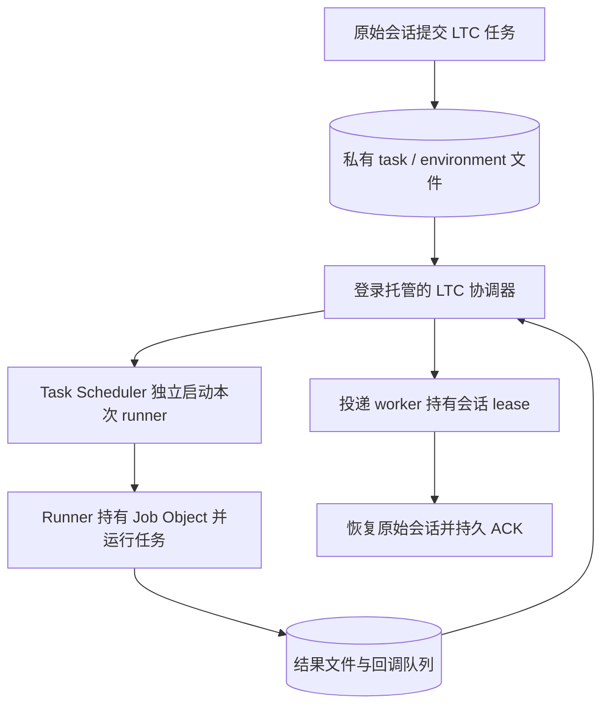

# LTC：Mac 完成后的 Windows 开发交接

交接日期：2026-09-26。面向在 Windows 机器上继续开发的 Agent / 维护者。

后续状态：Windows 原生实现及本机测试已完成，见 [Windows 指南](windows.md) 和
[Windows 验证记录](validation-windows.md)。当前 Desktop 原会话回调被 active-writer
检查阻止，尚未通过完整验收。下文保留为 Mac 交接时的历史基线。

## 1. 当前结论与接手基线

**macOS 适配已完成，并已在真实 Codex 会话中跑通 120 秒任务、回调和 ACK。下一阶段是原生 Windows 适配。**

| 项目 | 交接状态 |
| --- | --- |
| 仓库 | `https://github.com/lz59970062/long-task-wakeup.git` |
| 当前分支 | `codex/0.7.0-preview` |
| Mac 开发起点 | `7269b93`，Linux 架构预览提交 |
| 包版本 | `0.7.0a1`，本轮未发布或升版 |
| 交接提交范围 | Mac 适配源码、测试和交接文档一并提交；远端是否可拉取以实际推送状态为准 |
| Windows 当前状态 | **未实现**；诊断中的 `platform_unsupported` 是现状 |
| 本机验证 | macOS 26.6.2、arm64、Python 3.14.6；282 项测试中 280 通过、2 跳过 |
| 实际回调 | `9e4dabc9`：120.076 秒，exit=0，原会话收到，ACK 已保存，回调在 `done`，一次投递，任务作业已回收 |

`7269b93` 是开发起点，**不是含 Mac 适配的最终提交**。推送后，以包含本文及
`src/long_task_callback/platforms/macos.py` 的实际 Git HEAD 为接手基线，并记录 SHA。
不要只看 `ltc --version`：Linux 起点和本轮 Mac 改动的版本字符串相同。

先读以下文件：

1. 本文：状态、Windows 工作范围和验收条件。
2. [architecture.md](architecture.md)：生命周期、模块边界和恢复约束。
3. [validation-macos.md](validation-macos.md)：自动测试及真实回调证据、验证边界。
4. [macos.md](macos.md)：Mac 安装和运行方式。
5. [根目录 SKILL.md](../SKILL.md)：Agent 如何提交、接收并确认回调。

## 2. Mac 端交付了什么

- `platforms/macos.py`：`LaunchdBackend`、host/boot/process 身份、launchd 查询和已退出作业回收、UNIX socket 对端用户校验。
- `launchd_service.py`：用户 LaunchAgent 安装、配置预览、固定 Python/队列/Agent profile/PATH、现有协调器的安全重载。
- `cli.py`：默认平台选择，持久化 `launchd` 后端，worker 准入，平台身份分发，重载请求。
- `platforms/screen.py`：兼容 Apple 自带旧版 screen 的日志写入。
- `diagnostics.py`：macOS 进入支持平台，诊断与修复命令使用实际平台后端。
- `tests/test_macos.py`、`tests/test_launchd_integration.py`：新平台契约和真实进程生命周期验证；现有测试补齐平台隔离。
- CI、README、架构文档及两份技能文本已同步；CI 配置包含 Linux/macOS，但本轮没有运行远端 Actions。

核心拓扑是：LaunchAgent 运行协调器；每个业务任务由另一个一次性 launchd 作业运行。
任务 plist 放在私有任务目录中，不放进登录启动目录，不设置任务自动重启。
协调器可以重启，业务任务继续执行；无法确认启动结果时保留未知状态，不重复提交。

Mac 的一个实测细节必须保留：Agent 工具沙箱可能读不到 boot UUID，协调器会另存
`launch_boot_id`。恢复逻辑在 `running` 之前也会参考该字段；worker 准入会校验它。
缺少提交时的 boot 信息不应破坏正常启动，也不能被当作“已经重启”的证据。

## 3. 现有 Mac 机器的实际安装状态

本地旧版 `0.6.5a2` 协调器已在队列空闲时备份并替换为本轮 `0.7.0a1`。
用户 LaunchAgent 现指向 **Mac 检出的项目目录中的 `.venv/bin/python` 和源码 `_entry.py`**。
因此当前服务依赖该 checkout 和虚拟环境的稳定位置，维护时保留它们。

| 本机内容 | 位置 / 说明 |
| --- | --- |
| 服务配置 | `~/Library/LaunchAgents/codex-long-task-wakeup.plist` |
| 默认状态目录 | `${CODEX_HOME:-~/.codex}/long-task-wakeup/` |
| 协调器日志 | 状态目录下的 `daemon.log` |
| 旧服务备份 | 状态目录下的 `backups/launchagent-before-macos-0.7-20260926-141704.plist` |
| 两分钟任务产物 | 状态目录下的 `tasks/9e4dabc9/` |
| 回调及 ACK 证据 | `queue/done/9e4dabc9.json`、`queue/acks/9e4dabc9.json` |
| 已安装技能 | 本次 `setup --keep-skill` 保留了既有本地技能；仓库随包技能是更新后的文本 |

生产迁移和真实回调发生在自动化测试之后。不要继续沿用“没有改动实际服务 / 没有验证真实回调”
的旧描述。也不要把本机的虚拟环境、凭据、队列、会话记录或 LaunchAgent 配置复制进 Git 或 Windows。
Windows 上创建自己的 profile 和任务记录，在 Windows 原始会话里重新绑定回调目标。

## 4. Windows 开发机开始工作

以下命令在含 Mac 交接的提交已经推送后，于 PowerShell 中执行：

```powershell
git clone --branch codex/0.7.0-preview https://github.com/lz59970062/long-task-wakeup.git
Set-Location long-task-wakeup
git log -1 --oneline
Test-Path .\docs\handoff-macos-to-windows.md
Test-Path .\src\long_task_callback\platforms\macos.py
git switch -c codex/windows-support

py -3 -m venv .venv
& .\.venv\Scripts\python.exe -m pip install -e .
& .\.venv\Scripts\ltc.exe --version
& .\.venv\Scripts\ltc.exe --help
& .\.venv\Scripts\python.exe -c "import os,sys; print(sys.version); print(sys.platform, os.name)"
```

如果未安装 `py` 启动器，使用开发机实际 Python 路径创建 venv。无需为此修改执行策略或激活脚本；
上面直接调用虚拟环境中的可执行文件。先记录 Windows 版本、架构、Python 版本、普通用户权限、
Agent CLI 安装形式，以及是否运行在 Agent 沙箱内。

预期此时 `--help` / `--version` 能用于检查安装，Windows 的生产者诊断仍报告不支持。
Python 包能安装不代表原生任务生命周期已可用。先完成平台原语和隔离测试，再启用 Windows 支持声明。
原生验收应实际运行在 `sys.platform == "win32"`、`os.name == "nt"` 的环境；WSL 按 Linux 部署单独记录。

## 5. 必须保持的生命周期契约

1. `run` / `agent` 先保存任务、环境、原始会话和 owner intent，再请求独立的 OS 任务 owner。
   协调器和当前 Agent turn 都不能成为业务进程存活的唯一依托。
2. 后端确定后写入记录；恢复时按记录查询。`ALIVE / ABSENT / UNKNOWN` 必须保持三态。
   调度器不可用、权限不足或解析失败都不能作为重新执行的依据。
3. `LaunchError(uncertain=True)` 表示管理器可能已接受请求；先核对既有记录和结果。
   worker 尚未握手也不等于命令肯定没有执行。
4. worker 在任务锁内核对 queue、task ID、attempt、owner、host/boot 和本次启动身份，
   保存 `running` 后才运行命令；先保存 `result.json`，再发布 completion callback。
5. 所有后端共用结果和回调语义。非零退出码仍可属于“执行已完成”；中断或未知结果单独表达。
6. 回调 ID 稳定，投递是 at-least-once；持久 ACK 单调。重复投递不能导致重复业务执行。
   callback ACK、goal ACK 和 `cancel` 的既有语义保持；`cancel` 当前只取消回调。
7. 同一个原始 Agent 会话跨多个队列也只能有一个有效投递 owner。协调器退出后，
   仍在投递的 worker 必须继续持有正确的会话 lease；不要仅靠一个可过期的 PID 文本文件互斥。
8. owner 的消失不是成功或从未执行的证明；已有持久结果优先。主机重启或换机不自动重跑任务。
9. 普通回调 ACK 只需要当前队列的写权限；全局 retained lease 的额外清理由协调器处理。
10. 提示词和完整环境留在私有文件。平台注册信息、命令行和错误输出只包含必要的 worker 参数与文件引用。

## 6. Windows 尚缺的具体接入点

以下函数名是现有代码入口，建议按名称搜索，不依赖本文撰写时的行号。

| 范围 | 现有入口 | Windows 需要解决的事情 |
| --- | --- | --- |
| 执行后端 | `platforms/base.py` 的 `ExecutionBackend` / `LaunchError` / `OwnerState` | 新的 Windows owner、提交和三态查询；保留不确定结果 |
| 后端接入 | `select_execution_backend`、`native_backend`、`load_managed_task`、`launch_managed_task`、`run_task_worker` | 选择、记录验证、恢复与原生 worker 准入必须一起接入 |
| 身份 | `host_platform`、`current_machine_id`、`current_boot_id`、`daemon_process_identity` | 当前非 Darwin 路径走 Linux；新增 Windows host/boot/process 身份和安全进程句柄操作 |
| 私有持久化 | `storage.py`、`platforms/posix.py`、`cli.fsync_directory`、`move_request` | Windows ACL、原子替换、flush/持久化、文件共享和跨目录移动语义；不能把 `chmod(0600)` 当成完整 Windows ACL |
| 锁 | `acquire_path_lock`、`acquire_owner_lock`、`release_owner_lock`、`delivery_lock_is_held` | 当前依赖 `fcntl.flock`；需要进程退出可释放、可观察且无双 owner 的 Windows 实现 |
| 投递锁交接 | `run_resume_until_exit_or_ack`、`delivery_worker_main`、`close_parent_lock_copy` | `pass_fds`、`CODEX_LONG_TASK_DELIVERY_LOCK_FDS` 及 raw fd 关闭路径要替换为可靠的 Windows 句柄/同步对象协议 |
| 进程树 | `terminate_process_group`、`stop_resume_process`、`run_managed_worker_locked` | `killpg`、信号和 session 行为的原生替代，避免只杀 wrapper 后留下子进程 |
| 协调器 | `select_daemon_service`、`setup`、`daemon`、`daemon_reexec_command` | 登录托管、启动/更新/移除、后台环境和安全更新；不能直接照搬 POSIX `os.execv` 重载假设 |
| 诊断 | `environment_profile`、`queue_writable`、`coordinator_issue`、`runtime_issues` | 当前直接使用 POSIX 同步和 flock；支持声明、只读运行态检查和 Windows 修复命令一起实现 |
| 原始会话投递 | `agents/codex.py`、`agents/claude.py`、`desktop_app_server_socket`、`AppServerConnection` | 验证实际 Windows CLI 路径、profile 和会话绑定；Desktop transport 另行验证 |
| 命令与路径 | `runtime.worker_command`、`console_script_path`、`prepare_request_for_queue`、`shlex.quote/join` 的调用点 | Python/安装路径有空格时仍可执行；ACK 命令能在目标 shell 中直接使用；验证 `.exe` / npm `.cmd` 启动方式 |
| 用户文档 | CLI choices/help、README、两份 SKILL、`pyproject.toml`、CI | 功能验证后统一更新，不提前把 Windows 标成已支持 |

特别注意回调 worker 的句柄传递：Python 的 `pass_fds` 是 POSIX 功能，Windows 的进程创建和
继承句柄有不同接口；保持 lease 语义后再替换具体实现。[Python subprocess 文档](https://docs.python.org/3/library/subprocess.html)

当前 ACK 文本使用 POSIX shell quoting。Windows 的命令展示和执行需要按实际 shell 单独处理；
`shlex.quote` 的适用范围是 Unix shell。[Python shlex 文档](https://docs.python.org/3/library/shlex.html)

## 7. 建议实现路线（尚未实现）

沿用架构交接中既定方向：**用户登录协调器 + 每次尝试独立的按需计划任务 runner + Job Object 管理业务进程树**。
具体模块名、backend/service 名称和 Windows API 封装方式由接手实现确定，以下不是已经存在的 CLI 选项。



### 阶段 A：平台基础能力

先实现/抽取 Windows 私有文件、原子写入、锁、同步句柄和进程身份。评估最低 Windows 版本及
标准库 `ctypes` / 条件依赖的选择，并记录决定；保持既有 Linux/macOS 的 Python 版本承诺。
保留现有 `cli` wrapper，便于现有测试注入，不在整个协调器中到处复制 OS 分支。

### 阶段 B：独立任务 runner

一个 queue/task/attempt 对应一个独立 owner。任务定义只调用固定运行时和私有文件引用。
业务任务不挂登录触发器、周期触发器或自动失败重跑；管理器启动返回不明确时进入 reconciliation。
调度器的同名多实例策略需显式配置；`IgnoreNew` 可以阻止同一任务同时出现新实例，仍需 LTC 自己的
attempt 准入和结果核对。[Microsoft 多实例策略](https://learn.microsoft.com/en-us/windows/win32/taskschd/tasksettings-multipleinstances)

检查 Task Scheduler 的执行时间上限、电源/空闲条件、错过触发补跑和重启配置，避免默认策略
改变长任务语义。例如默认执行上限是 72 小时，`ExecutionTimeLimit=PT0S` 表示不设该上限。
最终策略要明确写入配置及测试。[Microsoft 执行时间上限](https://learn.microsoft.com/en-us/windows/win32/taskschd/tasksettings-executiontimelimit)

runner 持有业务 Job Object 的生命周期，协调器退出不应关闭唯一的任务控制句柄。
`KILL_ON_JOB_CLOSE` 会在最后一个 Job 句柄关闭时终止关联进程，因此句柄归属与泄漏都需要测试。
[Microsoft Job Objects](https://learn.microsoft.com/en-us/windows/win32/procthread/job-objects)

业务进程运行前应已进入 Job。可评估创建时的 `PROC_THREAD_ATTRIBUTE_JOB_LIST`；若使用
“挂起创建 → AssignProcessToJobObject → 恢复线程”，需处理 runner 在中间崩溃留下挂起进程的窗口。
还要在 Agent 沙箱已有外层 Job 的情况下实测。
[Microsoft 关于创建时关联 Job 的说明](https://devblogs.microsoft.com/oldnewthing/20230209-00/?p=107812)

### 阶段 C：协调器、诊断与投递

在任务独立性有证据后，完成用户登录托管及 `setup --service auto` 的 Windows 路由。
把 host、boot、进程创建身份、queue 绑定纳入协调器验证；旧 PID 不能授权终止或替换进程。
Mac 的 `daemon-reload.json` 可参考其“由当前 owner 自校验请求”的思路，但 Windows 更新进程的
方式需重新实现，并保证活跃投递及其 lease 不被粗暴打断。

先验证 Agent CLI 恢复原会话及 ACK，再考虑 Windows Desktop transport。
Desktop socket 不可用时保留明确的 CLI 路径；不要把回调绑定改成 `--last` 或另一台机器的旧会话。
确认 PATH/profile、认证与用户身份来自实际运行环境；调度器不能依赖交互 shell 中临时激活的 venv。

### 阶段 D：兼容性与文档

统一 Windows backend 的持久化标识、CLI 参数、记录版本判断、doctor、日志和安装说明。
需要 Windows 专属依赖时使用平台条件；保持 Linux/macOS 导入和安装不受影响。
核心仍是 Python，npm/冻结分发不是本阶段的前置要求，也不能替代 native 生命周期验收。

## 8. 验收清单

| 场景 | 接受条件 |
| --- | --- |
| 基础命令 | `run`、`agent`、`done`、`ack`、`doctor`、`setup` 按 Windows 实际环境工作 |
| 终端与协调器退出 | 关闭提交终端、终止/重启协调器，真实任务继续；恢复只得到一次业务执行 |
| runner 崩溃 | 进程树按既定策略收束；结果是中断/未知，不伪造成功或自动重跑 |
| 管理器状态不明 | RPC/权限失败、超时、启动响应丢失均不触发重复命令 |
| 结果恢复 | 已有结果优先；结果写成后回调写入失败可用同 ID 恢复 |
| 锁与 lease | 同队列单协调器、跨队列同会话互斥、投递 worker 生命周期内正确持锁 |
| 回调 | 真实当前会话收到并 ACK；重复回调不重复业务工作；ACK 无需额外全局写权限 |
| 身份与重启 | PID 复用不误操作；boot 改变、未知 boot、外来 host 记录处理清楚且不自动重放 |
| 文件/路径 | 私有 ACL、原子替换失败、带空格/中文/特殊字符路径、日志和提示词文件、可执行 ACK 命令 |
| 升级与清理 | 更新协调器不打断活跃投递；收集退出 owner 不误杀活跃任务；不改变旧任务归属 |
| 既有平台 | 保留 Linux/macOS 测试；Windows CI 只跳过确实平台专属的测试，不把通用生命周期缺口跳过 |

测试采用隔离 profile/队列和临时任务名称，先用 fake Agent 验证本地链路。最终在 Windows 上
重复本轮的真实两分钟演示，记录 task ID、实际时间、exit、原会话到达、ACK 和作业清理结果。
首次 Windows 验收记录建议放 `docs/validation-windows.md`；区分真实测试、模拟测试和未验证项目。
尚无完整 Windows LTC 生命周期时，按阶段运行短前台测试，不反复执行平台不支持的 setup。

## 9. Git 交接与后续交付

本轮 Mac 交接提交包含源代码、测试和文档，包括新增的 macOS 模块及 Windows 交接文件。
后续提交也应检查 `git status` 和 diff，避免用 `git commit -am` 漏掉新增文件。
`.venv/`、用户 profile、回调队列、认证信息和本机生产服务备份均留在本机。

用户随后明确要求推送时，将本轮交接提交推送到 `codex/0.7.0-preview`，给出实际提交 SHA。
Windows 开发从该 SHA 新建分支；交接完成前不需要预先发布版本或改写历史。

Windows 侧交付至少包括实现、平台及共享测试、CI、安装说明、验证记录、同步后的技能文本，
以及实际提交 SHA。到时再按用户意图安排合并、推送或版本发布。

## 10. 可直接发给 Windows Agent 的任务

> 请先阅读 `docs/handoff-macos-to-windows.md`、`docs/architecture.md` 和 `docs/validation-macos.md`。
> 当前 LTC 的 Mac 适配已经完成，并通过真实 120 秒回调演示；接下来请在这台 Windows 机器上实现
> 原生 Windows 支持，保持 Linux/macOS 行为和原始会话回调语义。先确认拉取的提交包含 Mac 适配，
> 记录本机环境，按平台原语、独立任务 runner、协调器与投递、诊断文档的顺序推进。任务必须由
> 独立 OS owner 托管，未知启动结果不自动重跑，结果先落盘，ACK 不等于目标完成。
> 完成隔离测试及真实两分钟回调，再更新 Windows 安装与验证文档。记录尚未验证的限制，
> 并为后续提交推送保留完整可审查改动。
