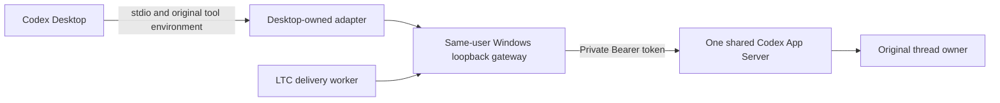

# Experimental Windows Desktop callback bridge

This opt-in adapter is intended to let Codex Desktop and LTC use **one App
Server**, so callback delivery reaches the process that already owns the thread.
It is not enabled by ordinary Windows setup. The existing Desktop conversation's
end-to-end callback acceptance test remains pending until a deliberate Desktop
restart and original-session delivery/ACK test.

## Findings and sources

On this machine, Codex Desktop 26.915.4065 starts its Core with the default stdio
transport. Its process had no TCP listener, its default control socket did not
exist, and read-only `app-server daemon version` / `app-server proxy` probes failed
outside the Agent sandbox. The Windows AF_UNIX driver was running; those failures
are not proof that every Windows Unix-socket implementation is unavailable.

The installed Desktop code accepts a `CODEX_CLI_PATH` executable override and
`CODEX_APP_SERVER_FORCE_CLI=1`. These were verified in this installed build's
implementation, **not documented as stable public Desktop configuration APIs**.
An already connected Desktop does not adopt environment changes in another shell.
Its direct WebSocket override has no local Bearer-header setting, and starting a
server before Desktop loses the fresh App Tools pipe environment supplied by
Desktop. The launcher therefore uses a Desktop-owned stdio adapter. Desktop
starts that adapter with its original Core flags and fresh environment, which
the adapter passes to the real Core while changing only its transport.

The official [App Server protocol](https://learn.chatgpt.com/docs/app-server)
documents multiple client transports, initialization, `thread/resume`,
`turn/start`, and authentication before JSON-RPC initialization. It labels
WebSocket transport experimental and unsupported for production workloads.
The [CLI changelog](https://learn.chatgpt.com/docs/changelog) describes a newer
read-only transcript/retry behavior for conversations already open elsewhere;
that is not evidence that upgrading removes the single-writer requirement.

An isolated real Codex 0.153.4 server was tested with a disposable empty profile:
an anonymous WebSocket handshake returned **401**, a capability-token handshake
returned **101**, and initialization plus `thread/loaded/list` succeeded. No model
turn or existing conversation was used in this probe.

A second real-server integration test connected **two independent clients** to
the gateway. The first created a disposable test thread and persisted a fixture
with the documented `thread/inject_items` operation (no model generation); the
second resumed the same thread while the first remained connected. It passed,
and drained stop removed the bridge metadata and private token. The test uses a
separate empty profile, not the current Desktop session. Reproduce with:

```powershell
$env:LTC_TEST_CODEX_BRIDGE = '1'
& .\.venv\Scripts\python.exe -m unittest discover -s tests -p test_desktop_bridge_integration.py -v
```

The test requires an installed Codex CLI exposing those protocol methods and
ordinary user socket/process access. Its empty profile needs no credentials.
It also passed with this Desktop's exact Core version, `0.155.0-alpha.9.2`, using
the executable cache copy whose SHA-256 matches the installed package. Set
`LTC_TEST_CODEX_BRIDGE_BIN` to select that executable for the integration test.
With that native executable selected, a second test uses Desktop's stdio
protocol through the adapter and LTC's separate WebSocket connection. It verifies
that both access one owned thread and that closing stdin ends both connections.
Set `LTC_TEST_DESKTOP_CORE_WRAPPER` to the absolute installed
`ltc-desktop-core.exe` path to exercise the installed console launcher too.

## Connection and trust model



The gateway authenticates the Windows process on every connected TCP socket by
its reverse connection tuple, PID, SID and creation identity. Only literal IPv4
loopback is accepted. Before sending its HTTP handshake, LTC also verifies that
the server matches the private bridge metadata's PID, identity and Codex profile.

The gateway rejects browser Origin headers and invalid/ambiguous upgrades before
opening an upstream connection. It verifies the upstream belongs to its launched
process tree before inserting the private token. The upstream listener itself
requires the token; it is not an anonymously accessible alternate entrance.
No token is stored in the Desktop URL, process arguments, metadata or ordinary
status output. Private files use the existing Windows ACL implementation.

This permits native processes belonging to the current Windows user; it does not
claim to distinguish trusted applications from other code running as that user.
Administrator/SYSTEM access remains outside this isolation boundary. OS peer
identity is checked on connection; an authenticated owner can delegate a socket.

The stdio adapter preserves JSON-RPC IDs, responses, notifications and
server-initiated tool/approval requests. It does not initialize on Desktop's
behalf. Diagnostics go to stderr, never the protocol stream. Desktop's stdin EOF
ends the adapter, gateway and owned Core even if LTC still has a connection.
The real Desktop tool/approval routing for a turn initiated by the second LTC
client remains part of the live acceptance test; byte forwarding alone does not
prove that routing. Read-only inspection of the packaged App Tools client found
the normal pipe environment path and no direct-parent PID requirement there.
The native service-side process ancestry rules could not be established from
that code, so only a normal App Tools call after restart can settle compatibility.

LTC does not guess ports or silently switch to CLI delivery after an explicitly
configured bridge fails. Before `turn/start`, it persists submission intent.
If the worker dies or a response is lost, the retained lease prevents another
callback attempt until the outcome is resolved. ACK or a confirmed completion
can clear that intent; a missing response cannot.

## Opt in after closing Desktop

Changing the App Server requires closing **all** Codex Desktop windows/processes.
Save or finish active work first. The supplied launcher refuses to stop a running
Desktop and does not rewrite installed app files or global environment settings.
It starts Desktop with overrides only in that new process's environment. Desktop
then starts `ltc-desktop-core.exe`, which owns the gateway and real Core. The
script does not change the caller's environment or prestart a separate server.

From this checkout, first install the updated package so its new console entry
point exists in `.venv`:

```powershell
& .\.venv\Scripts\python.exe -m pip install -e .
# Read-only preflight is safe while Desktop is still running:
& .\examples\windows\start-desktop-bridge.ps1 -CheckOnly
# After saving work and closing Desktop:
& .\examples\windows\start-desktop-bridge.ps1
```

Optional launcher arguments are `-Python`, `-CodexHome`, `-CodexBin`,
`-DesktopExe` and `-CoreWrapper`. Use the actual existing Codex profile; do not copy authentication
files into a test profile. If the launcher fails, inspect the private bridge log
and do not start a second unverified server against the same conversation.
The launcher discovers the GUI through its package manifest, checks both its
launcher and resident process, and selects a runnable Core cache copy only when
its SHA-256 matches the installed Desktop bundle. It does not default to an older
global npm CLI. It verifies that the adapter's `--version` passthrough returns
the selected Core's version. Direct packaged-GUI startup and inheritance of the
temporary CLI override remain part of the explicit restart validation.

The metadata is `<CODEX_HOME>\long-task-wakeup\desktop-bridge.json` by default.
After reopening the original conversation, configure the existing LTC coordinator
with that explicit metadata file, preserving its original name and queue:

```powershell
$ltcProfile = if ($env:CODEX_HOME) { $env:CODEX_HOME } else { Join-Path $env:USERPROFILE '.codex' }
$env:CODEX_LONG_TASK_WAKEUP_DESKTOP_BRIDGE_FILE = Join-Path $ltcProfile 'long-task-wakeup\desktop-bridge.json'
& .\.venv\Scripts\ltc.exe setup --service windows-task --keep-skill --force --now
```

For a custom deployment, include its existing `--name` and `--queue-dir`. The
Windows coordinator pins the bridge metadata path in its private configuration.
Each delivery reloads that metadata and rechecks the connected peer.

First verify that Desktop actually connected to the bridge and opens the exact
original thread, and that a harmless Desktop App Tools operation works. Then
validate one completion callback, inspect its artifacts using the resumed
conversation's tools and ACK from that conversation. A protocol probe or a test Agent's ACK is not that
acceptance test. Keep task `1aa2ba13` and its failed callback as prior evidence;
recover its callback only after checking that no previous delivery arrived. Do not
rerun its already completed business command or manually manufacture an ACK.

## Inspect and stop

```powershell
& .\.venv\Scripts\python.exe -m long_task_callback.desktop_bridge --status
# Only if a standalone gateway remains after its clients close:
& .\.venv\Scripts\python.exe -m long_task_callback.desktop_bridge --stop
```

Use the same `--codex-home` and `--metadata-file` if customized. Normally closing
Desktop also ends its adapter and removes the metadata; `--stop` is for a
remaining standalone gateway with no clients. Stop is bound to the recorded
live process and refuses active clients. The bridge does not install an automatic
login task or restart itself. Its Job owns the App Server process tree; exiting
the bridge ends that tree. Normal shutdown verifies Job membership through native
process handles and waits for its children to exit before releasing private state.
The kill-on-close Job also contains abnormal exits. Independently scheduled LTC
business tasks keep their separate ownership.

To return to ordinary Desktop startup, close Desktop and any remaining bridge, remove
`CODEX_LONG_TASK_WAKEUP_DESKTOP_BRIDGE_FILE` from the shell used for LTC setup and
update the same coordinator. Start Desktop normally. CLI delivery again has the
original active-writer limitation while Desktop owns the thread.
